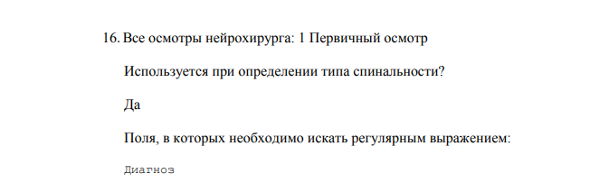

# METHOD.md

## Текущая задача

### Актуальность

См. в других разделах этого файла.

### Цель

Оценить корректность подсчета поступивших за период с 30.01.2019 по 05.02.2019.

Основная гипотеза: (а) запрос выдает меньше поступивших за этот период (с 30.01.2019 по 05.02.2019), чем выявлено при поиске вручную, и (б) причина этого — в том, что не было за этот период спинальных операций у этих пациентов _и_ спинальные КТ или МРТ, которые были сделаны, в Ариадне на момент выполнения запроса еще не описаны.

### Материал

Экспортирую поступивших из Ариадны, и тут их ВНЕЗАПНО (на самом деле, не внезапно) много.

И возникает вопрос: почему выбрал именно эти даты? Почему именно _столько_ дней? Дыра в дизайне.

А ответ простой: об этом просто не подумали. Какой взяли интервал на рутинной проверке запроса, такой и остался. Надо думать в таких вещах…

Итого получилось 1359 историй. Выгружали по каждому дню сначала из АКО, затем из ПО, начиная с 30.01.2019 00:00, сортировка по возрастанию даты поступления.

Запустил запрос по дате поступления с 30.01.2019 по 04.02.2019. Вернул всего 1 запись.

Форму подготовил: все необходимые поля (см. ниже планирование результатов) заполнил, в том числе в `submission_date` внес для всех записей текущие дату и время.

`ft_form_7.csv` (неанонимизированный) — готов к загрузке в БД FormTools.

Однако с учетом того, что записей — 1359, а запрос из них выдал только 1, просматривать их все вряд ли нужно, и, если релевантные спинальные записи, не выданные запросом, и есть в этой выборки, то можно попробовать их выцепить и понять причины из отсутствия в результатах запроса, взяв меньшее число записей.

Для этого отсортируем записи в случайном порядке (в `submission_id` загрузим 1359 случайных чисел без повторения, которые сейчас возьмем с [RANDOM.ORG](https://random.org) — готово, см. [список из 1359 случайных чисел](https://github.com/p1m-ortho/xs-led-dzhanelidze-global-spine-query/blob/96b8cb62c7ea1791bd4eb503bd8652a84c18dccb/RANDOM.ORG%20-%20Integer%20Set%20Generator.html)) и затем будем просматривать хотя бы до количества, которое необходимо на уровне значимости ~~0,99~~ 0,01 при мощности 0,9 (это сейчас рассчитаем на ближайшем онлайн-калькуляторе для социологических исследований; только вот для какого статистического теста это будет подсчет? непонятно).

Согласно методу, приведенному на странице [калькулятора размера выборки от Raosoft](http://www.raosoft.com/samplesize.html), и с использованием нижеследующих параметров минимальный размер — следующий (далее копипаста со страницы сайта):

```
What margin of error can you accept?
5% is a common choice

1
%
The margin of error is the amount of error that you can tolerate. If 90% of respondents answer yes, while 10% answer no, you may be able to tolerate a larger amount of error than if the respondents are split 50-50 or 45-55. 
Lower margin of error requires a larger sample size.
What confidence level do you need?
Typical choices are 90%, 95%, or 99%


99
%
The confidence level is the amount of uncertainty you can tolerate. Suppose that you have 20 yes-no questions in your survey. With a confidence level of 95%, you would expect that for one of the questions (1 in 20), the percentage of people who answer yes would be more than the margin of error away from the true answer. The true answer is the percentage you would get if you exhaustively interviewed everyone. 
Higher confidence level requires a larger sample size.
What is the population size?
If you don't know, use 20000

1359
How many people are there to choose your random sample from? The sample size doesn't change much for populations larger than 20,000.
What is the response distribution?
Leave this as 50%

0.0736
%
For each question, what do you expect the results will be? If the sample is skewed highly one way or the other,the population probably is, too. If you don't know, use 50%, which gives the largest sample size. See below under More information if this is confusing.
Your recommended sample size is	
48
This is the minimum recommended size of your survey. If you create a sample of this many people and get responses from everyone, you're more likely to get a correct answer than you would from a large sample where only a small percentage of the sample responds to your survey.
```

Итак, нужно просмотреть хотя бы 48 историй.

0.0736 получили как 1 / 1359 (т. к., если верить нашему запросу, среди 1359 записей должна быть только 1 спинальная; мы же хотим показать, что это не так).

Итак, возьмем первые 48 (случайных уже на данный момент) записей из 1359 и загрузим их в БД.

Полную версию файла тоже на всякий случай загрузим в БД, но в отдельную таблицу.

Подготовил и загрузил сокращенную и полную версии в БД FormTools.

Формы готовы к заполнению для обоих заполняющих.

### Результаты

Завершила тест 48 случайных историй, потребовалось 63 минуты. 5 историй прошли по какой-либо из типов спинальности.

Завершил тест 48 случайных историй. Время выполнения: с 2019-02-11 13:36 по 2019-02-11 14:27, но 8 записей уже заполнил ранее, а также отвлекался. Не знаю, сколько историй прошли по какому-либо из типов спинальности: надо смотреть.

```
Percent overall agreement = 87.50%

Free-marginal kappa = 0.75
95% CI for free-marginal kappa [0.56, 0.94]

Fixed-marginal kappa = 0.50
95% CI for fixed-marginal kappa [0.01, 0.99]
# of Cases: 48  # of Categories: 2  # of Raters: 2
```

Закрыл формы для редактирования для обоих участников.

### Обсуждение

Мозговые орехи:

1. Стоит ли добавить рентген позвоночника? Из опыта дежурства в ПО, многие спинальные пациенты поступают с подозрением на перелом. Им выполняют рентген, исключают диагноз и выписывают, не выполняя КТ или МРТ. Дело в том, что обычно это единственный диагноз, а значит, пациент исключительно спинальный. А с другой стороны, нет перелома - нет диагноза. У меня дилемма.

> Я склонялся и склоняюсь к тому, что не нужен, потому что по рентгену не закодировать по AO. Хотя это спорно, согласен.

2. Может, добавить в регулярные выражения вообще ДДЗП? Решили с [ПВЖ](https://github.com/pussiatoday) пополнить регвыр различными вариантами спинальной патологии.

> Будет потом (когда будем заявку PL/SQL-щикам писать, к примеру; там ведь надо будет все пожелания за один раз подать) повод еще раз просмотреть регвыр и убедиться, что все необходимые фрагменты, касающие нозологии по позвоночнику, мы туда включили.

### Планирование: методы

* Поднять электронные истории всех поступивших через приемное или АКО с 30.01.2019 00:00 по 04.02.2019 23:59.
* Извлечь списки в файлы.
* Перенести из этих файлов в [CSV-экспорт из созданной в FormTools формы](https://github.com/p1m-ortho/xs-led-dzhanelidze-global-spine-query/blob/340a619cecc202ed2b207073d1ab1f39a1551da2/ft_form_7.csv).
* Выполнить запрос по дате поступления с 30.01.2019 по 04.02.2019 и извлечь поступивших и их типы спинальности в файл.
* Заполнить на основании этого файла поля формы, касающиеся запроса.
* Загрузить этот файл в базу данных FormTools.
* Провести процедуру анонимизации (см. [приложение по анонимизации](#приложение-процедура-анонимизации)) и загрузить этот файл сюда, обновив файл [ft_form_7.csv](https://github.com/p1m-ortho/xs-led-dzhanelidze-global-spine-query/blob/master/ft_form_7.csv).
* Участники из личных аккаунтов получат доступ к веб-интерфейсу формы и дозаполнят недостающие поля: будут вручную открывать каждую историю и оценивать ее «тип спинальности» в соответствии с ранее разработанным алгоритмом (см. [приложение по алгоритму](#приложение-алгоритм-определения-типа-спинальности)).
* При этом в форме все вопросы имеют закрытый характер и имеют опцию «не выбрано» (вид формы см. ниже в разделе о планировании результатов), а также в форме нельзя добавить или удалить запись — можно только просмотреть все списком либо переключить на предыдущую или следующую.
* Ручной просмотр историй и сопоставление по критериям с заполнением таблиц будем выполнять независимо двумя людьми.
* По завершении заполнения — анонимизировать (см. [приложение по анонимизации](#приложение-процедура-анонимизации)) и экспортировать сюда, обновив файл [ft_form_7.csv](https://github.com/p1m-ortho/xs-led-dzhanelidze-global-spine-query/blob/master/ft_form_7.csv).
* Отвергнуть или принять основную гипотезу.
* Рассчитать показатели согласия между участниками в плане определения типа ([Online Kappa Calculator, Randolph J. J., 2008](http://justusrandolph.net/kappa/)).
* Вынести заключение о корректности или некорректности определения типа запросом в соответствии с алгоритмом (на данной выборке будет не сделать, т. к. мало будет результатов в выдаче запроса).

### Планирование: результаты

Создал форму в [FormTools](https://formtools.org) в режиме внутреннего пользования (т. е. форма доступна только из личного аккаунта участника).

Копипаста формы для каждого из заполняющих выглядит таким образом, при этом редактируемы только поля «Тип спинальности вручную» (можно выбрать тип, используя переключатель) и «Примечание» (до 2000 символов):

```
Путь поступления	
Дата и время поступления	
UPI (компьютерный номер)	
MRN (номер истории)	
Тип спинальности вручную	 Не выбрано 
 Спинальная операция 
 Спинальная КТ или МРТ 
 Спинальный осмотр 
 Спинальный диагноз поступления 
 Не спинальный диагноз поступления 
Примечание	
```

Сама FormTools хранит данные в отдельной таблице БД.

Всего в ней 15 полей (см. [экспорт из FormTools](https://github.com/p1m-ortho/xs-led-dzhanelidze-global-spine-query/blob/340a619cecc202ed2b207073d1ab1f39a1551da2/ft_form_7.csv); здесь и ниже CSV получены путем SQL SELECT из БД FormTools):

Из них 1 поле (`is_finalized`) — служебное, содержит значение `yes`, если форма подана, или `no`, если форма начата и заполнена, но еще не подана.

4 поля заполняются программой автоматически при подаче и изменении записи и содержат ее характеристики («Свидание» — кривой перевод для «Подано»):

```
data_type,field_title,col_name
number,ID,submission_id
date,Свидание,submission_date
date,Изменен,last_modified_date
number,IP-адрес,ip_address
```

4 поля заполним путем перенесения данных из списков поступивших:

```
data_type,field_title,col_name
string,Путь поступления,admission_mode
string,Дата и время поступления,admission_timestamp
string,UPI (компьютерный номер),upi
string,MRN (номер истории),mrn
```

2 поля заполним путем перенесения данных из результатов запроса:

```
data_type,field_title,col_name
string,Наличие в результатах запроса,is_retrieved_by_query
string,Тип спинальности по запросу,spinality_type_per_query
```

2 поля заполнит вручную один заполняющий:

```
data_type,field_title,col_name
string,Тип спинальности вручную,spinality_type_manual_1
string,Примечание,comment_1
```

2 поля заполнит вручную второй заполняющий:

```
data_type,field_title,col_name
string,Тип спинальности вручную,spinality_type_manual_2
string,Примечание,comment_2
```

Итого 15 полей.

### Приложение. Алгоритм определения типа спинальности

* Если за время госпитализации выполнялась хотя бы одна хирургическая операция, то если хотя бы одна из этих операций по коду соответствует одному из кодов, перечисленных в [приложении по кодам](#приложение-коды-спинальных-операций) (список внутренних кодов, применяемых в НИИ СП для кодирования спинальных операций; загрузим позднее), то включить в выборку (назовем этот критерий "Спинальная операция").
* Если не "Спинальная операция", но выполнялась хотя бы одна МРТ или КТ, то если в описании хотя бы одной из этих КТ или МРТ есть совпадение по маске "позвон", то включить в выборку ("Спинальная КТ или МРТ").
* Если не "Спинальная КТ или МРТ", то если был хотя бы один осмотр травматолога или нейрохирурга, то если в поле "Заключение" хотя бы одного из этих осмотров есть совпадение по регулярному выражению (см. [приложение по регулярному выражению](#приложение-регулярное-выражение--критерий-для-типов-спинальный-осмотр-и-спинальный-диагноз-поступления)), то включить в выборку ("Спинальный осмотр").
* Если не "Спинальный осмотр", то если в поле "Диагноз поступления" в "Протоколе регистратора" есть совпадение по регулярному выражению (см. [приложение по регулярному выражению](#приложение-регулярное-выражение--критерий-для-типов-спинальный-осмотр-и-спинальный-диагноз-поступления)), то включить в выборку ("Спинальный диагноз поступления").
* Если не подходит по "Спинальный диагноз поступления", то "Не спинальный диагноз поступления".

> Обратили внимание, что маски «позвон» вообще-то может быть и не достаточно для выявления всех релевантных описаний КТ и МРТ. Потом учтем, обдумаем.

> А поля «Заключение»-то нет во многих осмотрах! Эх вы. Не будет этот критерий работать.

### Приложение. Регулярное выражение — критерий для типов «Спинальный осмотр» и «Спинальный диагноз поступления»

Оригинальная версия:

```
/(позвон|спондил|спин|вертебр|шейн|грудн|поясни|шоп|гоп|поп|пкоп|([thтнcсlл]{1,2} ?\d{1,2})|псмт|ддз|хондро|грыж.*диск|радикул|кореш|каудопати|конск.*хвост|плеги|парез|паретическ|тазов.*орган)/i
```

> Обратили внимание, что в запросе совсем не упомянуты термины из серии спинальных вмешательств (например ТПФ). Нужно будет доработать.

Текущая версия (еще не внедрена):

```
/([Пп][Оо][Зз]|[Сс][Пп][Оо][Нн][Дд][Ии][Лл]|[Сс][Пп][Ии][Нн]|[Вв][Ее][Рр][Тт][Ее][Бб][Рр]|[Шш][Ее][Йй][Нн]|[Шш][Ее][Ии]|[Гг][Рр][Уу][Дд][Нн]|[Гг][Рр][Уу][Дд][Оо]|[Пп][Оо][Яя][Сс][Нн]|[Шш][Оо][Пп]|[Гг][Оо][Пп]|[Пп][Оо][Пп]|[Пп][Кк][Оо][Пп]|(\s[thТтcСсlЛл][hНн]?\s?\d{1,2})|[Пп][Сс][Мм][Тт]|[Кк][Оо][Мм][Пп][Рр]|[Дд][Дд][Зз]|[Хх][Оо][Нн][Дд][Рр][Оо]|[Гг][Рр][Ыы][Жж].*[Дд][Ии][Сс][Кк]|[Дд][Ии][Сс][Цц]|[Кк][Ии][Фф][Оо]|[Лл][Оо][Рр][Дд][Оо]|[Сс][Кк][Оо][Лл][Ии][Оо]|[Рр][Аа][Дд][Ии][Кк][Уу][Лл]|[Кк][Оо][Рр][Ее][Шш]|[Кк][Аа][Уу][Дд][Оо][Пп][Аа][Тт][Ии]|[Кк][Оо][Нн][Сс][Кк].*[Хх][Вв][Оо][Сс][Тт]|[Пп][Лл][Ее][Гг][Ии]|[Пп][Аа][Рр][Ее][Зз]|[Пп][Аа][Рр][Ее][Тт][Ии][Чч][Ее][Сс][Кк]|[Тт][Аа][Зз][Оо][Вв].*[Оо][Рр][Гг][Аа][Нн]|[Мм][Ии][Ее][Лл][Оо][Пп][Аа][Тт]|[Мм][Ии][Ее][Лл][Оо][Ии][Шш]|[Тт][Пп][Фф])/gi
```

### Приложение. Процедура анонимизации

Оставить только значения полей ниже, которые расцениваю как не содержащие идентифицирующую личность пациента информацию:

```
submission_id
is_retrieved_by_query
spinality_type_per_query
spinality_type_manual_1
spinality_type_manual_2
comment_1
comment_2
submission_date
last_modified_date
is_finalized
```

Значения всех остальных полей заменить на `*****`.

### Приложение. Коды спинальных операций

```
ВтмпНейр01
ВтмпНейр02
ВтмпНейро66
ВтмпОрто01
ВтмпОрто02
НейрСпинМозг1
НейрСпинМозг10
НейрСпинМозг11
НейрСпинМозг12
НейрСпинМозг13
НейрСпинМозг14
НейрСпинМозг2
НейрСпинМозг3
НейрСпинМозг4
НейрСпинМозг5
НейрСпинМозг6
НейрСпинМозг7
НейрСпинМозг8
НейрСпинМозг9
ТравмПозв1
ТравмПозв10
ТравмПозв11
ТравмПозв12
ТравмПозв13
ТравмПозв14
ТравмПозв2
ТравмПозв3
ТравмПозв4
ТравмПозв5
ТравмПозв8
ТравмПозв9
```

## Ручной контроль обновлений по запросу

Добавлена возможность поиска записей по дате поступления, и возможность отбора записей по типу спинальности. Добавлены критерии поиска по спинальному диагнозу, по спинальному осмотру. 

~~Запрос перестал работать: форма открывается, но всегда выдает ноль записей.~~ На поверку сейчас оказалось неправдой и почти наверняка было неправдой и тогда.

Проблема, похоже, в другом: у поступивших за этот период (с 30.01.2019 по 05.02.2019) не было за этот период операций _и_ снимки, которые были сделаны, в Ариадне еще не описаны.

Сейчас попробуем проверить эту гипотезу (посмотреть электронные истории известных пациентов, поступивших за это время), и если это действительно так, то это еще одно мощнейшее обоснование для двух оставшихся (до сих пор не доработанных) критериев включения («типов спинальности»): по тексту осмотров нейрохирургов и травматологов и диагнозу поступления.

Только что выполнили запрос без каких-либо ограничений, кроме `Спинальный осмотр, Спинальный диагноз поступления`. Запрос не вернул ни одной записи, что свидетельствует о том, что эти типы спинальности до сих пор находятся в разработке.

## Связь с компьютерным отделом и службой поддержки

PL/SQL-щики сообщают, что в работе. 

Только что компьютерный отдел сообщил, что поступили новые вопросы от PL/SQL-звена. Изучим.

В предыдущем нашем ответе был такой фрагмент (детали см. потом в [истории развития событий](#история-развития-событий):

> К задаче 5
>
> По нынешнему состоянию описание операции, КТ и МРТ заносятся в одно поле. При этом для записей, попавших в выборку по категории "Спинальная операция", описания + заключения КТ и МРТ не выбираются.
>
> Просим заносить эти данные в три отдельных поля: "Описание операции", "Описание КТ" и "Описание МРТ", — а также просим выбирать описания + заключения всех обнаруженных по данной истории КТ и МРТ (т. е. не только совпадающих по маске "позвон") для всех записей, попавших в выборку (вне зависимости от вида спинальности).
>
> В частности, для видов спинальности "Спинальный осмотр" и "Спинальный диагноз поступления" это не лишено смысла, поскольку в соответствии с логикой запроса в эти типы попадают только записи, не прошедшие по категориям "Спинальная КТ/МРТ", а значит они не должны иметь КТ и МРТ с релевантными описаниями — и проверить эту гипотезу мы сможем, только если описания этих (предположительно не релевантных) КТ и МРТ будут выбираться.

Так вот PL/SQL-щики попросили уточнить по задаче 5:

1. Как выводить КТ/МРТ для случаев с несколькими операциями: дублировать ли?
2. Выводить ли неспинальные КТ/МРТ по случаям спинальных КТ/МРТ.

Пока работаем над подробным ответом, где также отразим накопившиеся выявленные баги, пишем следующий ответ:

> Благодарим за проделанную работу по задаче 1! Уже активно используем эти функции.
> 
> Подробные уточнения по задаче 5 предоставим позже. 
> 
> Просим пока работать по задачам 2, 3, 4. 

Ответ передали отделу компьютерной поддержки.

Работаем на подробным ответом:

> Чтобы не забыть, сразу просим учесть два обстоятельства:
>
> * Просим дополнить запрос еще одним полем «Исход», куда заносить значения типа «Выписка», «Смерть» и т. д.
> * Ранее мы писали, что для установления типа спинальности «Спинальный осмотр» необходимо регулярным выражением проверять поле заключения в целом списке разных форм осмотров.
>
>     Так вот, мы заметили, что практически ни в одной из этих форм нужное нам поле не называется «Заключение», а называется «Диагноз» (иногда «ДИАГНОЗ») или «Предварительный диагноз», или как-то иначе.
>
>     Поэтому для полной ясности прикрепляем повторно список форм, на этот раз с четким указанием полей, по которым необходимо проходить регулярным выражением при определении типа спинальности «Спинальный осмотр».
>
>     Полный список всех полей всех нижеследующих форм подлежит включению в результаты запроса (в поле «Протокол осмотра»), но только часть из этих форм используется при определении типа спинальности (так как не во всех формах есть поле для заключения).
>
> 1. Первичный осмотр нейрохирурга (из блока Осн. протоколы ПО)
>
>     Используется при определении типа спинальности?
>
>     Да
>
>     Поля, в которых необходимо искать регулярным выражением: 
>
>     `ДИАГНОЗ`
>
> 1. Первичный осмотр травматолога (из блока Осн. протоколы ПО)
>
>     Используется при определении типа спинальности?
>
>     Да
>
>     Поля, в которых необходимо искать регулярным выражением: 
>
>     `Предварительный диагноз`
>
> 1. Все осмотры травматолога: 107 Предоперационный эпикриз (полный)
>
>     Используется при определении типа спинальности?
>
>     Да
>
>     Поля, в которых необходимо искать регулярным выражением: 
>
>     `с диагнозом:`
>
>     `основной`
>
>     `сопутствующий`
>
>     `осложнения`
>
> 1. Все осмотры травматолога: 112 Осмотр дежурного травматолога
>
>     Используется при определении типа спинальности?
>
>     Нет
>
> 1. Все осмотры травматолога: 125 Протокол установления смерти
>
>     Используется при определении типа спинальности?
>
>     Да
>
>     Поля, в которых необходимо искать регулярным выражением: 
>
>     `Диагноз`
>
> 1. Все осмотры травматолога: 14 Совместный осмотр с зав. отделением, руководителем отделения
>
>     Используется при определении типа спинальности?
>
>     Нет
>
> 1. Все осмотры травматолога: 176 Приемный статус травматолога
>
>     Используется при определении типа спинальности?
>
>     Нет 
>
> 1. Все осмотры травматолога: 192 Акт имплантации
>
>     Используется при определении типа спинальности?
>
>     Да
>
>     Поля, в которых необходимо искать регулярным выражением: 
>
>     `диагноз`
>
> 1. Все осмотры травматолога: 21 Приемный статус
>
>     Используется при определении типа спинальности?
>
>     Да
>
>     Поля, в которых необходимо искать регулярным выражением: 
>
>     `Диагноз при поступлении`
>
> 1. Все осмотры травматолога: 25 Дневник осмотра
>
>     Используется при определении типа спинальности?
>
>     Нет
>
> 1. Все осмотры травматолога: 28 Предоперационный эпикриз
>
>     Используется при определении типа спинальности?
>
>     Да
>
>     Поля, в которых необходимо искать регулярным выражением: 
>
>     `с диагнозом:`
>
>     `основной`
>
>     `сопутствующий`
>
>     `осложнения`
>
> 1. Все осмотры травматолога: 36 Совместный обход
>
>     Используется при определении типа спинальности?
>
>     Нет
>
> 1. Все осмотры травматолога: 5 Врачебный консилиум
>
>     Используется при определении типа спинальности?
>
>     Да
>
>     Поля, в которых необходимо искать регулярным выражением: 
>
>     `Диагноз по прибытию:`
>
>     `Диагноз, поставленный в отделении`
>
>     `Подтверждение диагноза`
>
> 1. Все осмотры травматолога: 59 Осмотр через 2 часа после операции
>
>     Используется при определении типа спинальности?
>
>     Нет 
>
> 1. Все осмотры травматолога: 6666 Эпикриз на ВК
>
>     Используется при определении типа спинальности?
>
>     Да
>
>     Поля, в которых необходимо искать регулярным выражением: 
>
>     `Диагноз основной`
>
>     `Осложнения`
>
>     `Сопутствующий`
>
> 1. Все осмотры нейрохирурга: 1 Первичный осмотр
>
>     Используется при определении типа спинальности?
>
>     Да
>
>     Поля, в которых необходимо искать регулярным выражением: 
>
>     `Диагноз`
>
> 1. Все осмотры нейрохирурга: 125 Протокол установления смерти
>
>     Используется при определении типа спинальности?
>
>     Да
>
>     Поля, в которых необходимо искать регулярным выражением: 
>
>     `Диагноз`
>
> 1. Все осмотры нейрохирурга: 135 Консультация дежурного нейрохирурга
>
>     Используется при определении типа спинальности?
>
>     Да
>
>     Поля, в которых необходимо искать регулярным выражением: 
>
>     `Заключение:`
>
>     `Диагноз`
>
> 1. Все осмотры нейрохирурга: 173 Приемный статус нейрохирурга
>
>     Используется при определении типа спинальности?
>
>     Нет     
>
> 1. Все осмотры нейрохирурга: 25 Дневник осмотра
>
>     Используется при определении типа спинальности?
>
>     Нет
>
> 1. Все осмотры нейрохирурга: 28 Предоперационный эпикриз
>
>     Используется при определении типа спинальности?
>
>     Да
>
>     Поля, в которых необходимо искать регулярным выражением: 
>
>     `Диагноз`
>
> 1. Все осмотры нейрохирурга: 46 Обход с зав. отделением и врачами отделения
>
>     Используется при определении типа спинальности?
>
>     Да
>
>     Поля, в которых необходимо искать регулярным выражением: 
>
>     `Диагноз`
>
> 1. Все осмотры вертебртолога
>
>     Используется при определении типа спинальности?
>
>     Да
>
>     Поля, в которых необходимо искать регулярным выражением:
>
>     На момент подготовки письма в категории «Вертебролог» не отображается ни одной формы, но при появлении там форм просим действовать по аналогии, во-первых, включив все поля из этих форм в результаты запроса, а во-вторых, использовав аналогичные поля этих форм при определении типа спинальности.
>
> 1. Консультация травматолога (из раздела Консультации)
>
>     Используется при определении типа спинальности?
>
>     Да
>
>     Поля, в которых необходимо искать регулярным выражением: 
>
>     `ДИАГНОЗ`
>
> 1. Консультация нейрохирурга (из раздела Консультации)
>
>     Используется при определении типа спинальности?
>
>     Да
>
>     Поля, в которых необходимо искать регулярным выражением: 
>
>     `ДИАГНОЗ`
>
> 1. Консультация вертебролога (из раздела Консультации)
>
>     Используется при определении типа спинальности?
>
>     Да
>
>     Поля, в которых необходимо искать регулярным выражением: 
>
>     `ДИАГНОЗ`
>
> Далее по Вашему запросу уточняем по задаче 5.
>
> Выдачу описаний операций, КТ, МРТ и текстов осмотров по историям болезни, прошедшим по какому-либо из типов спинальности, видим следующим образом.
>
> Есть четыре поля: для описания операции, описания КТ, описания МРТ и текста осмотра.
>
> Также есть еще пятое поле: для диагноза поступления. Оно заполняется всегда автоматически для всех записей при любом типе спинальности, и значение для этого поля берется из поля «Диагноз поступления» в «Протоколе регистратора».
>
> Порядок же заполнения первых четырех полей зависит от типа спинальности, и ниже приводим его детально для каждого типа спинальности с примерами.
>
> Порядок заполнения этих полей для спинальности «Спинальная операция»: внести столько записей с этим типом спинальности по данной истории болезни, сколько всего по этой истории:
>
> * операций со спинальным кодом,
> * плюс КТ, совпадающих по маске %позвон%,
> * плюс МРТ, совпадающих по маске %позвон%,
> * плюс осмотров с подходящим кодом.
>
> При этом хотя бы у одной из этих записей будет заполнено поле для описания операции, у остальных же записей будут заполнены или поле для описания операции (если по истории было более 1 операции, со спинальным кодом), или поле для описания КТ (если по истории были КТ, совпадающие по маске %позвон%), или поле для описания МРТ (если по истории были МРТ, совпадающие по маске %позвон%), или поле для текста осмотра (если по истории были осмотры с подходящим кодом).
>
> Порядок заполнения этих полей для спинальности «Спинальная КТ»: внести столько записей с этим типом спинальности по данной истории болезни, сколько всего по этой истории:
>
> * КТ, совпадающих по маске %позвон%,
> * плюс МРТ, совпадающих по маске %позвон%,
> * плюс осмотров с подходящим кодом.
>
> При этом хотя бы у одной из этих записей будет заполнено поле для описания КТ, у остальных же записей будут заполнены или поле для описания КТ (если по истории было более 1 КТ, совпадающей по маске %позвон%), или поле для описания МРТ (если по истории были МРТ, совпадающие по маске %позвон%), или поле для текста осмотра (если по истории были осмотры с подходящим кодом), а поля для описаний операций у всех записей заведомо будут пустые.
>
> Порядок заполнения этих полей для спинальности «Спинальная МРТ»: внести столько записей с этим типом спинальности по данной истории болезни, сколько всего по этой истории:
>
> * МРТ, совпадающих по маске %позвон%,
> * плюс осмотров с подходящим кодом.
>
> При этом хотя бы у одной из этих записей будет заполнено поле для описания МРТ, у остальных же записей будут заполнены или поле для описания МРТ (если по истории было более 1 МРТ, совпадающей по маске %позвон%), или поле для текста осмотра (если по истории были осмотры с подходящим кодом), а поля для описаний операций и КТ у всех записей заведомо будут пустые.
>
> Порядок заполнения этих полей для спинальности «Спинальный осмотр»: внести столько записей с этим типом спинальности по данной истории болезни, сколько всего по этой истории осмотров с подходящим кодом.
>
> При этом у всех этих записей будут заполнены поля для текстов осмотров, а поля для описаний операций, КТ и МРТ у всех записей заведомо будут пустые.
>
> Порядок заполнения этих полей для спинальности «Спинальный диагноз поступления»: внести одну запись с этим типом спинальности по данной истории болезни, при этом у этой записи все четыре поля заведомо будут пустые.
>
> Примеры:
>
> 1. По истории болезни 11111 имеется 11 операций, 2 из которых имеют спинальные коды, а также 5 КТ, 4 из которых совпадают по маске «%позвон%», 2 МРТ, 1 из которых совпадает по маске «%позвон%», и 7 осмотров, совпадающих по кодам.
>
>     По этой истории запрос выдаст 14 записей с типом «Спинальная операция» (2 + 4 + 1 + 7), каждая из которых будет содержать в соответствующем поле (описание операции / описание КТ / описание МРТ / текст осмотра) соответствующее значение.
>
> 2. По истории болезни 22222 имеется 6 операций, код ни одной из которых не является спинальным, а также 2 КТ, из которых 1 совпадает по маске «%позвон%», а одна нет, и 1 МРТ, которая совпадает по маске «%позвон%», плюс 2 осмотра, совпадающих по кодам.
>
>     По этой истории запрос выдаст 4 записи с типом «Спинальная КТ» (0 + 1 + 1 + 2), каждая из которых будет содержать в соответствующем поле (описание КТ / описание МРТ / текст осмотра) соответствующее значение.
>
> 3. По истории болезни 33333 имеется 2 операции, код ни одной из которых не является спинальным, а также 2 КТ, ни одна из которых не совпадает по маске «%позвон%», и 1 МРТ, которая совпадает по маске «%позвон%», плюс 2 осмотра, совпадающих по кодам.
>
>     По этой истории запрос выдаст 3 записи с типом «Спинальная МРТ» (0 + 0 + 1 + 2), каждая из которых будет содержать в соответствующем поле (описание МРТ / текст осмотра) соответствующее значение.
>
> 4. По истории болезни 44444 имеется 1 операция, код которой не является спинальным, а также 1 КТ, не совпадающая по маске «%позвон%», и 1 МРТ, не совпадающая по маске «%позвон%», плюс 3 осмотра, совпадающих по кодам.
>
>     По этой истории запрос выдаст 3 записи с типом «Спинальный осмотр» (0 + 0 + 0 + 3), каждая из которых будет содержать в поле для текста осмотра соответствующее значение.
>
> 5. По истории болезни 55555 имеется 2 операции, код ни одной из которых не является спинальным, а также 3 КТ, не совпадающие по маске «%позвон%», и 1 МРТ, не совпадающая по маске «%позвон%», и ни одного осмотра, совпадающих по кодам.
>
>     Учитывая эти обстоятельства, запрос должен выполнить поиск в поле для диагноза поступления по регулярному выражению.
>
>     Мы обновили регулярное выражение по сравнению с ТЗ, просим везде по запросу теперь использовать обновленную его версию:
>
>     `/([Пп][Оо][Зз][Вв][Оо][Нн]|[Сс][Пп][Оо][Нн][Дд][Ии][Лл]|[Сс][Пп][Ии][Нн]|[Вв][Ее][Рр][Тт][Ее][Бб][Рр]|[Шш][Ее][Йй][Нн]|[Гг][Рр][Уу][Дд][Нн]|[Гг][Рр][Уу][Дд][Оо]|[Пп][Оо][Яя][Сс][Нн][Ии]|[Шш][Оо][Пп]|[Гг][Оо][Пп]|[Пп][Оо][Пп]|[Пп][Кк][Оо][Пп]|(\s[thТтcСсlЛл][hНн]?\s?\d{1,2})|[Пп][Сс][Мм][Тт]|[Дд][Дд][Зз]|[Хх][Оо][Нн][Дд][Рр][Оо]|[Гг][Рр][Ыы][Жж].*[Дд][Ии][Сс][Кк]|[Дд][Ии][Сс][Цц]|[Кк][Ии][Фф][Оо]|[Лл][Оо][Рр][Дд][Оо]|[Сс][Кк][Оо][Лл][Ии][Оо]|[Рр][Аа][Дд][Ии][Кк][Уу][Лл]|[Кк][Оо][Рр][Ее][Шш]|[Кк][Аа][Уу][Дд][Оо][Пп][Аа][Тт][Ии]|[Кк][Оо][Нн][Сс][Кк].*[Хх][Вв][Оо][Сс][Тт]|[Пп][Лл][Ее][Гг][Ии]|[Пп][Аа][Рр][Ее][Зз]|[Пп][Аа][Рр][Ее][Тт][Ии][Чч][Ее][Сс][Кк]|[Тт][Аа][Зз][Оо][Вв].*[Оо][Рр][Гг][Аа][Нн]|[Мм][Ии][Ее][Лл][Оо][Пп][Аа][Тт]|[Мм][Ии][Ее][Лл][Оо][Ии][Шш]|[Тт][Пп][Фф])/gi`
>
>     Если вхождение есть, то по этой истории запрос выдаст 1 запись с типом «Спинальный диагноз поступления» (0 + 0 + 0 + 0), в которой все четыре поля (описание операции / описание КТ / описание МРТ / текст осмотра) будут пустые.

Ответ передал разработчикам.

15 дней назад от 13 ноября 2019 пришел ответ:
 
> Добрый день.
>
> Сделал выборку (602)-(40) Отчет по травмам позвоночника (новый)
>
> добавил поле "Исход" 
>
> Сделал 5 отдельных полей: описание операции, описание КТ, описание МРТ, текста осмотра и диагноз поступления.
>
> для примера в протоколе из ТЗ п.16 
>
> 
>
> добавил для поля "Диагноз" группу вопросов, по которой будут выбираться протоколы для спинального осмотра.
>
> Просьба добавить эту же группу к полям в других протоколах для определения спинального осмотра.
>
> Если будут недочеты или попадать некорректная информация - верните заявку на меня с конкретными примерами.

13 ноября 2019 в 11:38 отправили им такой ответ:

> Спасибо, изучим.
>
> Просим также отображать пациентов поступивших, но еще не выписанных, в том числе тех, которые "В госпитализации не нуждается".

Досылаем еще ответ:

> Подскажите, где можно найти эту группу вопросов? В настройках запроса не можем ее найти.
>
> Для внесения ясности еще раз поясняем.
>
> Запись считается «Спинальным осмотром», если она не «Спинальная операция», не «Спинальная КТ» и не «Спинальная МРТ» И регулярное выражение из ТЗ выдает вхождение по хотя бы одному из полей хотя бы одного из протоколов. Список конкретных протоколов и список конкретных полей в этих протоколах, по которым нужно проходить регулярным выражением, приводили в ТЗ.
> 
> Кроме того, эти протоколы используются не только для определения «Спинального осмотра», но и для извлечения из этих протоколов данных для поля «Текст осмотра» для всех включенных в выдачу историй болезни.
>
> То есть что должен делать запрос:
>
> * Для каждой попавшей в выдачу истории болезни (попала ли она туда как «Спинальная операция», «Спинальная КТ» или по любому другому из видов спинальности – не важно) просматривать, имеются ли по этой истории болезни протоколы осмотров каждого из перечисленных типов (т. е. есть ли по истории болезни 1. Первичный осмотр нейрохирурга (из блока Осн. протоколы ПО), 2. Первичный осмотр травматолога (из блока Осн. протоколы ПО), … , 26. Консультация вертебролога (из раздела Консультации) – и если есть, то все поля (конкатенированные в одну строку, естественно) каждого из этих протоколов выдавать в «Текст осмотра» отдельными записями). Идея тут в том, что, если история болезни признается спинальной, нам важно получить в выдаче тексты всех возможных видов осмотров, которые по этой болезни были (каждый из них, естественно, отдельной записью).
> * И, наконец, использование протоколов осмотров как критерия для спинальности «Спинальный осмотр». Если история болезни не прошла ни по «Спинальной операции», ни по «Спинальной КТ», ни по «Спинальной МРТ», то нужно, чтобы запрос снова прошел по всем протоколам осмотров каждого из перечисленных типов (т. е. 1. Первичный осмотр нейрохирурга (из блока Осн. протоколы ПО), 2. Первичный осмотр травматолога (из блока Осн. протоколы ПО), … , 26. Консультация вертебролога (из раздела Консультации)), но на этот раз выбирая только те поля, что мы отразили в ТЗ для каждого из протоколов, и проходя по этим полям регулярным выражением из ТЗ. Если хотя бы одно вхождение по хотя бы одному из прохождений будет, то историю болезни считать «Спинальным осмотром» и включать.
>
> Наконец, еще раз обращаем внимание – это не связано с протоколами осмотров, но все же, – что убедительно просим реализовать выдачу запросом не только историй болезни, имеющих дату выписки, но и историй болезни, не имеющих даты выписки. Таких ситуации нам известно две: когда больные поступили в институт и еще не выписаны (продолжают госпитализацию), либо были выписаны из приемного отделения, и тогда в поле «Отделение»  у них значится  "В госпитализации не нуждается", а дата выписки отсутствует (пример – *****). Ни те, ни другие на сегодняшний день не выдаются запросом. Очень просим это добавить, поскольку очень важно нам видеть поступающих больных в реальном времени, пока они еще не выписаны, а также видеть выписывающихся с приемника, так как они составляют большую часть потока.

Отправил наконец очередную обратную связь разрабам. С купюрами на анонимность см. ниже.

```
Здравствуйте!

> Такие пациенты будут отображаться только при спинальном диагнозе.

Вопрос 1. Возможно ли отображение таких пациентов также при спинальных операциях, спинальных КТ/МРТ и спинальных осмотрах? В частности см. комп. номера ***** и *****: этим пациентам выполнялись КТ, и в протоколах фигурирует маска `позвон`, однако пациенты отсутствуют в выдаче.

Вопрос 2. Также оказалось, что регулярное выражение, видимо, выполняется некорректно: см. комп. номер *****. По идее, должен был войти по типу спинальности "Спинальный осмотр", поскольку спин. операций/КТ/МРТ нет, но есть `Первичный осмотр травматолога (из блока Осн. протоколы ПО)`, где в поле `Предварительный диагноз` стоит "Ушиб ГОП" (подходит по регулярке). Однако если допустить, что отбор по типу "Спинальный осмотр" пока не по всем протоколам работает, то запись должна была войти как "Спинальный диагноз", так как там диагноз поступления "З.компрессионный перелом Th 6-7" — но ее нет в выдаче. Почему она не выдается?

Вопрос 3. Также мы обновили регулярное выражение, и просим заменить его на следующее:

/([Пп][Оо][Зз][Вв][Оо][Нн]|[Сс][Пп][Оо][Нн][Дд][Ии][Лл]|[Сс][Пп][Ии][Нн]|[Вв][Ее][Рр][Тт][Ее][Бб][Рр]|[Шш][Ее][Йй][Нн]|[Гг][Рр][Уу][Дд][Нн]|[Гг][Рр][Уу][Дд][Оо]|[Пп][Оо][Яя][Сс][Нн][Ии]|[Шш][Оо][Пп]|[Гг][Оо][Пп]|[Пп][Оо][Пп]|[Пп][Кк][Оо][Пп]|(\s[thТтcСсlЛл][hНн]?\s?\d{1,2})|[Пп][Сс][Мм][Тт]|[Кк][Оо][Мм][Пп][.Рр]|[Дд][Дд][Зз]|[Хх][Оо][Нн][Дд][Рр][Оо]|[Гг][Рр][Ыы][Жж].*[Дд][Ии][Сс][Кк]|[Дд][Ии][Сс][Цц]|[Кк][Ии][Фф][Оо]|[Лл][Оо][Рр][Дд][Оо]|[Сс][Кк][Оо][Лл][Ии][Оо]|[Рр][Аа][Дд][Ии][Кк][Уу][Лл]|[Кк][Оо][Рр][Ее][Шш]|[Кк][Аа][Уу][Дд][Оо][Пп][Аа][Тт][Ии]|[Кк][Оо][Нн][Сс][Кк].*[Хх][Вв][Оо][Сс][Тт]|[Пп][Лл][Ее][Гг][Ии]|[Пп][Аа][Рр][Ее][Зз]|[Пп][Аа][Рр][Ее][Тт][Ии][Чч][Ее][Сс][Кк]|[Тт][Аа][Зз][Оо][Вв].*[Оо][Рр][Гг][Аа][Нн]|[Мм][Ии][Ее][Лл][Оо][Пп][Аа][Тт]|[Мм][Ии][Ее][Лл][Оо][Ии][Шш]|[Тт][Пп][Фф])/gi

Вопрос 4. С учетом того, что регулярное выражение уже нам неоднократно приходилось корректировать, и оно все еще не носит окончательного характера — возможно ли добавить в форму запроса текстовое поле, где впредь мы могли бы самостоятельно регулярку править?

> Проверял за 10.11, добавились 5 пациентов (кроме пациентов со значением "В госпитализации не нуждается", попадает еще "Самовольный уход")
>
> Для "Спинального осмотра", в качестве примера, добавил основную группу на поле "Диагноз" в протоколе {{collapse(Первичного осмотра нейрохирурга)
>
> }}
> Просьба добавить эту же группу к полям в других протоколах для определения спинального осмотра.
> Если будут недочеты или попадать некорректная информация - верните заявку на меня с конкретными примерами пациентов и какая информация куда должна была попасть.

Вопрос 5. К сожалению, в Контенте у меня не отображается вкладка с формами, которая видна на скриншоте. В итоге я не могу самостоятельно добавлять основную группу к необходимым полям. Что необходимо предпринять, чтобы сделать это? Скрин моего Контента прикрепляю ниже. 
```

## История развития событий

Историю развития событий загрузим позднее.
